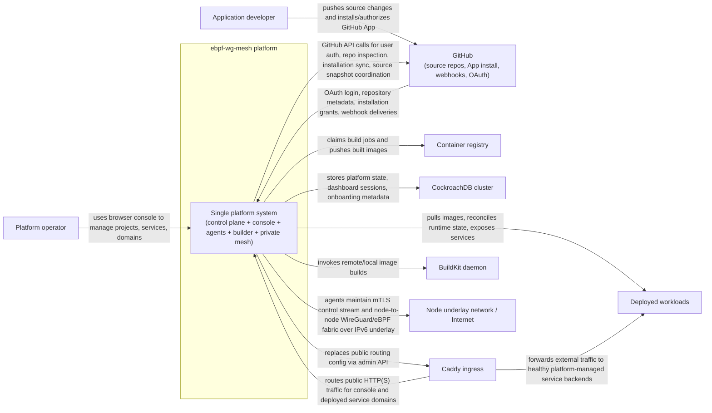

# C4 System Context Diagram

This is a C4 System Context view of the whole repository at the "system as a black box" level.

System boundary:

- `ebpf-wg-mesh platform`
- Internally implemented here by the control plane, node agents, builder worker, managed console, retained WireGuard/eBPF mesh layer, and supporting bootstrap/test tooling

## Relationship Notes

- The primary human actor is the platform operator using the browser console.
- GitHub is both an identity/source-control dependency and an event source via webhooks.
- CockroachDB is the authoritative persistent store for both control-plane data and console session/account data.
- Caddy is external to the platform system boundary in this diagram because the control plane drives it through the admin API rather than owning it as an in-process component.
- BuildKit and the container registry are separate external runtime dependencies used by the builder path.
- The node underlay network is shown as an external system because the retained WireGuard/eBPF mesh rides on top of host/network infrastructure rather than replacing it.

## Repo Mapping

- `cmd/controlplane`, `internal/controlplane`: control-plane authority, scheduling, GitHub coordination, ingress sync, PKI, internal gRPC
- `console/`: browser-facing console and GitHub sign-in/webhook ingress surface
- `cmd/agent`, `internal/agent`, `internal/mesh`, `internal/firewall`, `internal/wgmesh`: node runtime, desired-state reconciliation, private mesh, eBPF policy
- `cmd/builder`, `internal/builder`: build worker that claims jobs, materializes source snapshots, runs `buildctl`, and reports build status
- `api/proto/`: system APIs between console, control plane, builder, and agents
- `cmd/localteststack`, `infra/test-vm/`: local/VM harnesses for exercising the same system in development and smoke tests
