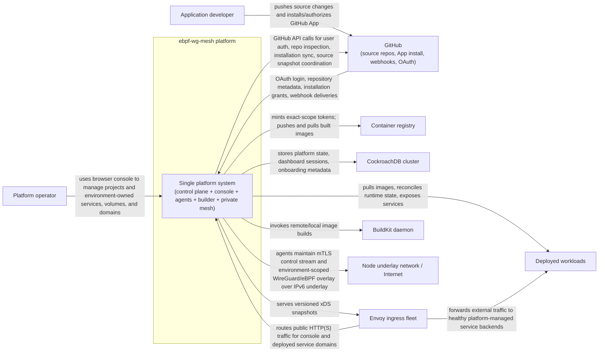

# C4 System Context Diagram

This is a C4 System Context view of the whole repository at the "system as a black box" level.

System boundary:

- `ebpf-wg-mesh platform`
- Internally implemented here by the control plane, node agents, builder worker, managed console, retained WireGuard/eBPF mesh layer, and supporting bootstrap/test tooling

## Relationship Notes

- The primary human actor is the platform operator using the browser console.
- GitHub is both an identity/source-control dependency and an event source via webhooks.
- CockroachDB is the authoritative persistent store for both control-plane data and console session/account data.
- The console owns GitHub OAuth, canonical user profiles, cookies, and browser sessions in its own CockroachDB schema.
- The console signs a 30-second user assertion for each platform RPC and sends it over mTLS. The control plane verifies its signature, issuer, audience, expiry, and subject, then authorizes the operation from user-ID memberships and roles without storing a duplicate user profile.
- GitHub repository access is linked to a project. Repository inspection and deployment require that project-specific grant rather than any installation grant visible to the platform.
- Projects own access and grouping; every deployable resource and private network belongs to one environment.
- Envoy is external to the platform system boundary because the control plane is the xDS authority rather than owning the proxy process. Current code still drives a single Caddy via the admin API until that cutover.
- xDS to Envoy is authenticated. There is no unauthenticated proxy admin API on the public network.
- BuildKit and the container registry are separate external runtime dependencies used by the builder path.
- Registry token minting and ACL decisions are embedded in the control plane. The external registry verifies signed access locally from the persisted control-plane trust certificate; no separate credential-broker service is required.
- The node underlay network is shown as an external system because the retained WireGuard/eBPF mesh rides on top of host/network infrastructure rather than replacing it.
- Each agent is sent only the allocations assigned to that node. Identity policy is a pool deny plus exact allows for environments the node hosts (including remote allocations in those environments). Unknown destinations and cross-environment traffic fail closed. Current code still floods a cluster-wide catalog to every agent.
- WireGuard peers exist only between nodes that share an environment and between those nodes and Envoy instances that publish their services. There is no full mesh.
- Workload health comes from HTTP probe results rather than container existence. Production probe sockets originate inside the workload network namespace, only ready ports become ingress backends, and probe failures remain visible as allocation phase and failure detail.

## Repo Mapping

- `cmd/controlplane`, `internal/controlplane`: control-plane authority, scheduling, GitHub coordination, ingress sync, PKI, internal gRPC
- `console/`: browser-facing console and GitHub sign-in/webhook ingress surface
- `cmd/agent`, `internal/agent`, `internal/mesh`, `internal/firewall`, `internal/wgmesh`: node runtime, desired-state reconciliation, private mesh, eBPF policy
- `cmd/builder`, `internal/builder`: build worker that claims jobs, materializes source snapshots, runs `buildctl`, and reports build status
- `api/proto/`: system APIs between console, control plane, builder, and agents
- `cmd/localteststack`, `infra/test-vm/`: local/VM harnesses for exercising the same system in development and smoke tests
